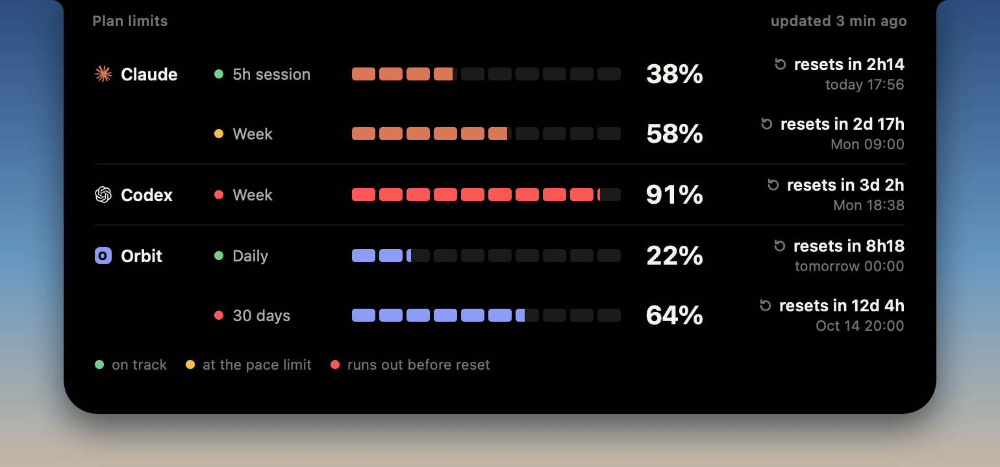

# AIControlNotch

**English** · [Português (Brasil)](README.pt-BR.md)

**See how much of your AI plan you have used without leaving your work: Claude, Codex and any model you add, right in the MacBook notch.** No more typing `/usage` in the terminal.





## Install

You need a Mac with macOS 14 or later.

### The easy way: ask your AI assistant

Open an AI assistant that can run commands on your Mac, such as Claude Code or Codex, and paste this:

```text
Install AIControlNotch on my Mac and connect the AI tools I use. Clone https://github.com/noha-agencia/AIControlNotch.git into ~/AIControlNotch (or update it if it is already there), then follow docs/install-with-ai.md in that folder step by step. Ask me before changing anything on my system.
```

It checks your Mac, builds and installs the app, connects Claude and Codex, and helps you connect your other AI tools. It asks before every change. The steps it follows are in [docs/install-with-ai.md](docs/install-with-ai.md).

### By hand

Install the Command Line Tools if you do not have them (`xcode-select --install`), then:

```bash
git clone https://github.com/noha-agencia/AIControlNotch.git ~/AIControlNotch
cd ~/AIControlNotch
./scripts/install.sh
```

The script checks your system, builds the app from source, copies it to `/Applications`, asks whether to open it at login, and opens it. Because it is built on your Mac, macOS shows no Gatekeeper warning.

- **Update:** `cd ~/AIControlNotch && git pull && ./scripts/install.sh`
- **Uninstall:** `cd ~/AIControlNotch && ./scripts/uninstall.sh`. It asks before deleting your settings and never touches `~/.claude/settings.json`.

## Connect your AIs

| AI | How it connects |
|---|---|
| **Claude** (Claude Code) | Through the Claude Code status line: Claude Code hands it your plan limits, and a small wrapper saves them for the app. Your AI assistant sets it up with your OK, or see [How it works](docs/how-it-works.md#claude-code-status-line). Needs Claude Code in a terminal with a Claude plan. |
| **Codex** (ChatGPT app or `codex` CLI) | Automatic. Sign in to Codex once. |
| **Any other AI** | A small script that reads the usage the tool already shows on your Mac. Ask your AI assistant to write it for you, or do it yourself: [Add a model](docs/add-a-model.md). |

To connect another tool later, paste this into your AI assistant (change the name):

```text
Connect Gemini to AIControlNotch. Follow step 6 of https://github.com/noha-agencia/AIControlNotch/blob/main/docs/install-with-ai.md and ask me before changing anything.
```

Only tools that show their usage on your Mac, in a file or through a command of their own, can be connected. Scripts never scrape websites or ask for your passwords.

## Features

- **Always in sight, never in the way.** At rest, the notch shows the highest usage of two pinned models, each with a pace dot.
- **Hover to see everything.** The open panel lists every limit of every model, up to 6 models: usage bar, percent and when it renews.
- **Pace dot: "will this last until it renews?"** Green: comfortable. Amber: right at the edge. Red: you will run out before it renews. Gray: data older than 30 minutes.
- **Alerts every 10 points.** When any limit crosses 10%, 20% and so on up to 100%, the notch shows how much is left and when it renews, also over full-screen apps.
- **Any model, your way.** A model added with a script gets the same pace dot and the same alerts.
- **English and Portuguese**, following the system language. On a Mac without a notch, it sits at the top centre of the screen.

Right-click the notch for **Refresh now**, **Configure models…**, **Reload models** and **Open at login**. There is no Dock icon: the notch is the app.

## Privacy in short

- Everything runs on your Mac. No telemetry, no analytics, no auto-update. **Nothing is sent to Noha or to anyone else.**
- **The app makes no network requests of its own** and never reads a login, token or password.
- **Claude:** only the limits Claude Code itself hands to its status line, saved by a small wrapper on your Mac.
- **Codex:** the app asks your local Codex for the numbers; Codex reaches OpenAI with its own login. The app never reads `~/.codex/auth.json`.
- **Scripts** run locally, without a shell, with a minimal environment and your permissions.

The details are in [How it works](docs/how-it-works.md) and [SECURITY.md](SECURITY.md).

## Help

- [Troubleshooting](docs/troubleshooting.md)
- [How it works](docs/how-it-works.md): data sources, what is stored, the Claude Code status line, menu and command line
- [Add a model](docs/add-a-model.md): the script format and rules
- Something wrong? Open a [bug report](https://github.com/noha-agencia/AIControlNotch/issues/new/choose).

## Contributing

Bug reports, new model scripts and pull requests are welcome. Read [CONTRIBUTING.md](CONTRIBUTING.md) first. To report a security problem, see [SECURITY.md](SECURITY.md).

## License

[MIT](LICENSE), Copyright (c) 2026 Noha.

## Disclaimer

AIControlNotch is an independent project. It is not affiliated with, endorsed by or sponsored by Anthropic or OpenAI. Claude, Claude Code, Codex and ChatGPT are trademarks of their owners. Their names and logos are shown only to identify the services the app reads from. The logo shapes come from [Simple Icons](https://simpleicons.org).

---

Made by [Noha](https://nohaoficial.com.br), a Brazilian agency that builds custom tools and AI for teams.
